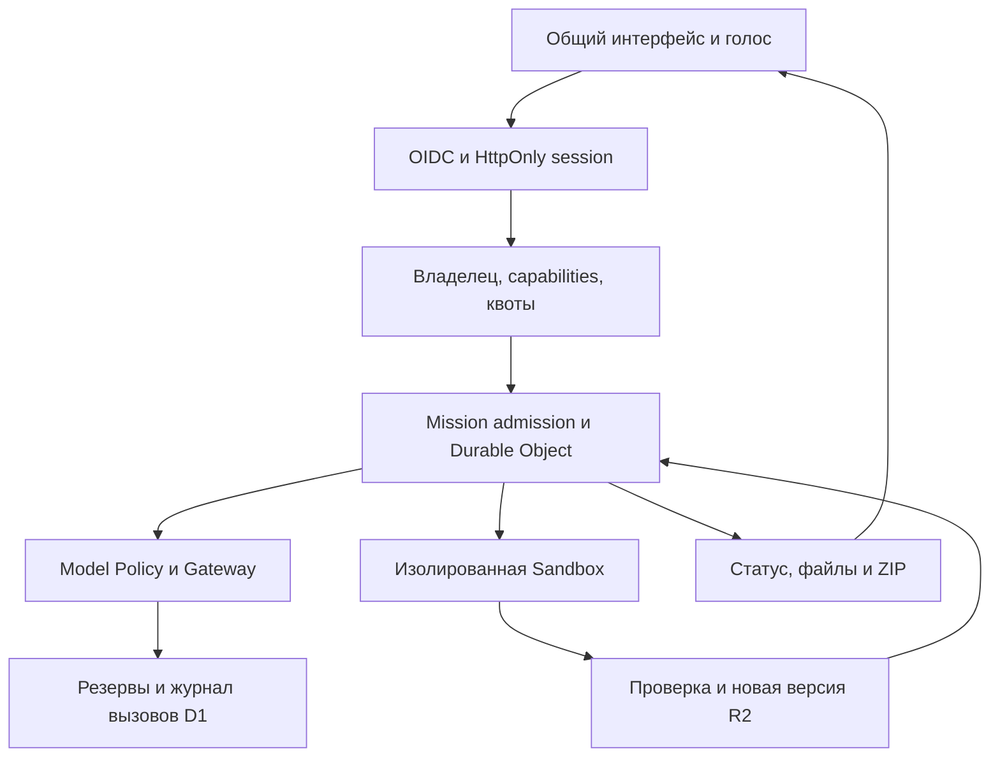

> Обновление 1.4.0: актуальные страницы, изменения и roadmap описаны в [AUDIT_1.4_RU.md](AUDIT_1.4_RU.md). Production UI больше не импортирует Three.js или географические данные; ui/navigation.ts и ui/studios.ts задают страницы модулей.

# Архитектура, сценарий и Roadmap

## Что проектировать первым

Первым — границу идентичности и Policy Engine. Без неё роутер и Ledger не знают, кому принадлежат расход и данные. Затем атомарный Ledger и идемпотентность; после них выбор моделей и Sandbox. Наличие 229 названий не решает ни одну из этих задач.

## Общая схема

Основной Worker — модульный монолит. Одна граница HTTP не означает одно общее хранилище секретов или один привилегированный пользователь. Durable Object сериализует работу проекта; внешние вызовы защищены отдельными резервами и ключами идемпотентности.

## Сценарий «один запрос»

1. Пользователь входит через IdP, задаёт цель текстом либо записывает голос. Распознанный текст проверяет перед отправкой.
2. UI создаёт projectId и Idempotency-Key; сервер устанавливает принадлежность проекта из сессии.
3. Admission сохраняет принятие запроса в D1 до запуска. Повтор возвращает результат принятия.
4. Mission outbox и Durable Object продолжают работу независимо от открытой вкладки. Неопределённые шаги не переисполняются автоматически.
5. Модель получает доступные tools и узкий контекст. Права и квоты проверяет сервер на каждом вызове.
6. Файлы записываются в workspace; крупная перезапись требует явного признака. Код переносится в уникальную папку Sandbox.
7. Выход Sandbox проверяется, затем публикуется новая версия R2. Удаление/изменение кода не меняет бизнес-таблицы D1.
8. Для задач с изменением кода отсутствие успешных исполняемых проверок даёт needs_input. Это относится и к восстановленной миссии.
9. Пользователь получает сохранённый проект и ZIP. Публикация SaaS и подключение его реальных платежей являются отдельными авторизованными шагами.

## Схема D1

Исполняемый SQL: `schema.sql`, добавочная миграция `migrations/008-unified.sql`.

| Таблица | Основной ключ / назначение |
|---|---|
| access_accounts | id; отозванность, роль, срок, хеш API-ключа legacy |
| oidc_states | state_hash; одноразовый PKCE verifier, nonce, origin, TTL |
| web_sessions | token_hash; account_id, origin, TTL |
| resource_owners | kind + resource_id; единственный владелец |
| missions / mission_outbox | mission id; состояние и доставка задачи |
| mission_admissions | ключ запроса + hash тела; защита от повторного запуска |
| mission_checkpoints | результат шага, определённость выполнения |
| spend_limits / model_calls | денежные резервы текстовых моделей и фактическое usage |
| resource_budgets | scope + unit; лимит и committed_units |
| resource_ledger | id; fingerprint, резерв, actual, uncertain/settled/released |
| workspace_heads | project id; активный префикс версии R2 |
| backup_manifests | независимые снимки workspace |
| studio_artifacts | id + account_id; R2 key, MIME, размер |

`resource_ledger` умеет единицы micro_usd, neuron, request, second, byte. В этой сборке на него подключён общий дневной лимит вызовов провайдеров. Денежные вызовы используют существующий транзакционный `model_calls/spend_limits`; UI собирает их в журнал. **Полной сверки общего счёта Cloudflare и фактических Neurons, хранения/простоя Sandbox этот релиз не реализует.** Не подключённая единица измерения не объявляется работающим счётчиком.

Reserve выполняется атомарно в D1 batch. При неизвестном ответе резерв остаётся. Повтор settlement не возвращает средства второй раз. Превышение фактическим usage заявленной верхней границы закрывает ресурсный бюджет до разбирательства; это не отменяет уже выставленную сумму.

Контракты: `src/unified/contracts.ts`. Они отделяют MissionSpec, ToolCall и ResourceReservation от свободного текста модели. Нынешний движок использует также совместимые внутренние типы AZRAIL; полная замена всех старых DTO — отдельная миграция.

## Что осталось до production-приёмки

| Этап | Работа | Критерий завершения |
|---|---|---|
| 1 | Настроить OIDC и три домена | Реальный вход/выход, второй аккаунт не видит чужие данные |
| 2 | Проверить binding и AI Gateway | Получен фактический ответ каждой разрешённой модальности, usage сверено |
| 3 | Подготовить зависимости Sandbox | Сгенерированный проект проходит typecheck/test/build в закреплённом образе |
| 4 | Свести все ресурсные единицы в учёт | Повторная доставка, таймаут и concurrency не обходят лимит; счёт сверяется |
| 5 | Мигрировать данные PULSE/Firebase | Dry-run mapping, количество записей/хеши, восстановление backup |
| 6 | Перенести остальные старые студии | На каждую есть API, файл результата, отрицательные и живые проверки |
| 7 | Добавить OAuth-интеграции | Изоляция tenant credentials, scopes, отзыв доступа, signed webhooks |
| 8 | Beatport и аудио pipeline | Два Top-10, дата/источник, права на аудио, реальные спектральные метрики |
| 9 | Телефонная и нагрузочная приёмка | 320/390/768/1440 px, слабая сеть, закрытие вкладки, отмена, бюджет |
| 10 | Бенчмарк конкурентов | Одинаковые задачи, бюджет, слепая оценка и воспроизводимые результаты |

На Free отсутствует полноценная серверная контейнерная среда. Универсальный SaaS-конвейер, дорогая генерация музыки/видео и полный запуск всех внешних моделей не могут обещаться в пределах любой бесплатной квоты.

## Дополнение 1.3: подключение, контракт и черновики

`src/unified/connectors.ts` находится за той же OIDC/CSRF-границей. `connector_connections` содержит account-scoped зашифрованный доступ и проверенный каталог; `connector_calls` — подготовленные параметры, revision/digests, статус и результат. `connector_oauth_states` хранит одноразовые PKCE-состояния. Внешний effect допускается через CAS, затем резерв request-budget и повторную проверку схемы. Модель не выдаёт себе approval.

`studio_drafts` использует ключ account_id+studio_id, `project_design_contracts` — project_id с проверкой resource_owners. Обе записи используют baseRevision и возвращают 409 при конкурентном изменении. Undo полей студии не откатывает D1 транзакции приложения.

Исполняемый SQL дополнен миграцией 009. Подробные протоколы и пределы: [CONNECTORS_RU.md](CONNECTORS_RU.md). Актуальный roadmap с критериями: [TASK_1.3_RU.md](TASK_1.3_RU.md).
