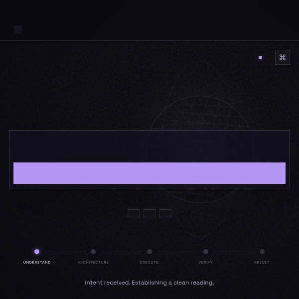

# Сверка GitHub и Canva перед передачей сборки

Проверено 29 сентября 2026. Это дополнение к аудиту исходных ZIP.

## GitHub: текущая ветка содержит более новые изменения

Репозиторий: https://github.com/mnmllpulse/azrail-os
Проверенный commit: `a47b688939a55c567a32aba57a50c38e3f894021`. Ветка `main`, package version `0.8.1`.

Сравнение Git blob SHA с байтами исходного AZRAIL ZIP: **22 новых файлов,
12 изменённых файлов, 191 совпадающих файлов**.
Проверено полное дерево; флаг truncated=false. Имена файлов подтверждают
наличие отдельных наработок, но не являются доказательством их исполнения.

В `package.json` уже добавлены `build:pulse`, staging-команды и новая версия Three.js.
`wrangler.staging.toml` отделяет staging и содержит незаполненные D1/KV/origin.
Фрагмент admission в `src/index.ts` уже разносит conflict/pending в отдельные ветви.
Эти изменения появились после версии из входного ZIP.

**Unified 1.1.0 — самостоятельная сборка из предоставленных архивов, а не
автоматически объединённый патч к этому commit.** Текущий GitHub не изменён,
ветка не перезаписана, PR и deployment не созданы. Проверки 1 079 тестов относятся
к Unified 1.1.0, а не к живому `main`.

### Как переносить в существующий репозиторий

1. Зафиксировать актуальную базовую ревизию и создать отдельную ветку интеграции.
2. Сопоставить список ниже, особенно migrations/020, проекты, presence и протокол миссий.
3. Переносить полезную функциональность с сохранением OIDC-владельцев и policy checks.
4. Объединить миграции добавочно, проверить на независимой D1 и R2.
5. Выполнить CI и живую проверку staging; после этого переключать нужные домены.

Для отдельной установки ZIP по умолчанию использует имя Worker `azrail-pulse`
и ресурсы с этим префиксом; это не миграция данных существующего `azrail-os`.
Не распаковывайте весь ZIP прямо поверх `main` с включённым автоматическим deploy.

### Новые относительно входного ZIP файлы

- `docs/STAGING_RU.md`
- `docs/UNIFICATION_PLAN_RU.md`
- `migrations/020-pulse-presence.sql`
- `public/pulse-globe.html`
- `public/pulse-studios.json`
- `public/pulse.html`
- `public/pulse.js`
- `public/system.html`
- `public/system.js`
- `scripts/build-pulse.mjs`
- `scripts/check-staging.mjs`
- `src/lib/presence.ts`
- `src/lib/project-workspace.ts`
- `src/lib/projects-api.ts`
- `src/lib/routing-mode.ts`
- `src/lib/studio-router.ts`
- `src/protocol/facade.ts`
- `src/protocol/mission.ts`
- `src/protocol/project.ts`
- `src/ui/pulse-globe.mjs`
- `tests/unification.test.ts`
- `wrangler.staging.toml`

### Изменённые относительно входного ZIP файлы

- `.github/workflows/check.yml`
- `package-lock.json`
- `package.json`
- `schema.sql`
- `scripts/migrate.mjs`
- `scripts/smoke.mjs`
- `src/agents/orchestrator.ts`
- `src/core/execution-engine.ts`
- `src/index.ts`
- `src/lib/model-router.ts`
- `src/types.ts`
- `wrangler.toml`

## Canva: проверка экспортированного превью

Макет: **AZRAIL Unified Interface Website**, ID `DAHWmofp_Os`, 1 страница.
Существующий макет открыт только для чтения; транзакция закрыта без сохранения.

| Приоритет | Наблюдение на странице 1 | Конкретное исправление |
|---|---|---|
| High | Большая фиолетовая полоса/кнопка в центре не содержит видимого текста | Явная подпись «Создать», доступное имя кнопки и видимый label поля |
| High | В верхней области не читаются AZRAIL и назначение продукта | Название продукта и короткий заголовок перед полем запроса |
| Med | Внизу видны UNDERSTAND, ARCHITECTURE, EXECUTE, VERIFY, RESULT | Для русского интерфейса — русские статусы; детали инженерного процесса в раскрываемом блоке |
| Med | Основная форма и тонкий глобус слабо отделяются от тёмного фона | Проверить контраст текста/границ и мобильный размер; усилить только ключевую форму |

Удачно: тёмная база, один фиолетовый акцент и орбитальный мотив соответствуют
выбранной стилистике. В Unified они сохранены; добавлены читаемые заголовки,
подписанное поле, «Создать», русский основной интерфейс и клавиатурный focus.

Ограничение наблюдения: вывод относится к полученному PNG. Rich-text API не вернул
элементов, а транзакция не раскрыла editable fills. Поэтому нельзя заключать,
что живой Canva-сайт действительно пустой: возможна неполная отрисовка экспорта.
Точные шрифты и hex-цвета из макета не подтверждены. Реальный UI Unified в браузере
остаётся отдельным пунктом приёмки; это превью Canva не выдаётся за скриншот сборки.
