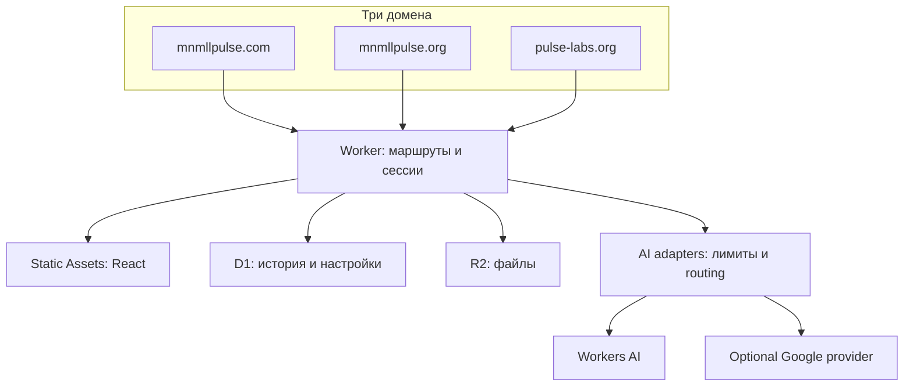

# DARK MNMLL PULSE OS — аудит и перенос на Cloudflare

Дата: 28 сентября 2026. Выпуск: **1.0.0-cf**. Исходник: `dark-mnmll-pulse-os (21)(1).zip`.

## Результат

Подготовлена версия исходников с Cloudflare Worker, D1/R2, доступом владельца, четырьмя адаптерами Workers AI и конфигурацией трёх доменов. Исправлены блокирующие сборку и перенос ошибки, а также несколько опасных и ложных сценариев исходника. Проект не опубликован; аккаунт Cloudflare, DNS, реальные AI-вызовы и визуальная приёмка остаются непроверенными.

Это перенос работающего ядра и сохранение старых студий с описанными ограничениями. Это **не завершение каждого прототипа** большого проекта. В архиве есть детальная матрица возможностей и план дальнейшей разработки.

## Объём и метод

Исходный ZIP: **350 файлов**, 5 217 156 байт распакованного содержимого; 261 файл в `src/`, в том числе 199 TSX. Проверена структура архива, пути, конфигурации, зависимости, сборка, серверные маршруты, вызывающий их клиентский код и критические сценарии безопасности.

Выполнена автоматическая инвентаризация всех текущих исходных модулей и исторических файлов. Она сохраняет пути, размеры, SHA-256, ссылки на API и лексические маркеры прототипов. Углублённо переработаны entrypoints, авторизация, API, хранилища, AI routing, загрузки, ALS parser, CI, preview и подключённые сценарии студий. Не утверждается ручная проверка каждой строки всех файлов или всех комбинаций интерфейса.

В `docs/cloudflare-2026-09-26/` находятся исходные ошибки сборки, результаты проверок и воспроизводимый индекс. Папка названа по началу работ; результаты этого отчёта относятся к выпуску 28 сентября.

## Найдено и исправлено

| Приоритет | Проблема исходника | Исправление |
|---|---|---|
| P0 | GitHub публиковал `dist/` как статику, но API жил в Express; скомпилированный сервер попадал в публичный каталог | Native Worker API + Static Assets. Сервер не публикуется как статический `.cjs` |
| P0 | Сервер запускал daemon через child_process, писал `.env`/файлы и держал память в процессе | Production API перенесён на D1/R2; daemon и filesystem scripts вынесены в `legacy/` |
| P0 | Frontend-admin=true и известный встроенный admin token не давали настоящей защиты | Server-side owner sessions, secret вне frontend, D1-хэши сессий, отзыв после смены ключа |
| P0 | Код терминала выполнялся через `new Function` в основном окне приложения | Исполнение удалено. Терминал честно сообщает об отсутствии runtime |
| P0 | Preview включал `allow-same-origin`; parent принимал сообщения без проверки окна | Изолированный iframe с `allow-scripts`, `srcdoc`, фильтр `event.source`, ограничение логов |
| P1 | `npm ci` не соответствовал package-lock | Lockfile восстановлен, ненужные серверные зависимости удалены, чистая установка проверена |
| P1 | TypeScript не проходил из-за неверных props студий | Исправлены контракты компонентов; отдельно проверяется Worker в strict-режиме |
| P1 | Старые платёжные/генерационные сценарии могли сообщать успех при заглушке или ошибке | Фиктивные тарифы/деплой заменены; сервер возвращает честные статусы. Нет SVG-успеха вместо ошибки изображения |
| P1 | Название выбранной модели не гарантировало реальный provider/model | Серверный allowlist; four-adapter каталог. Неподключённые ID отклоняются; весь набор swarm проверяется до первого AI-вызова |
| P1 | Не было серверной защиты от случайных внешних AI-вызовов | Два разрешения, отдельный request limit, запрет скрытого paid fallback; неверная provider-конфигурация не меняет классификацию оплаты |
| P1 | Память, владельцы и загрузки не имели единого защищённого persistent API | D1 owner-scoped history/settings/ledger, R2-index и проверка доступа к скачиванию |
| P1 | Непроверенные входные JSON, audio/XML и операции могли расходовать ресурсы | Лимиты тела, текста, моделей, истории, файлов; gzip/XML-ограничения, запрет DTD/entities |
| P1 | Клиент и video/music API расходились по именам полей/методам | Исправлены operationName/done/POST download, audioUrl, отсутствие автоматической подмены ошибки симуляцией |
| P1 | Node server и старый Worker stub описывали несовместимые bindings | Один корневой wrangler, реальные DB/R2/AI/ASSETS bindings, additive migrations |
| P1 | API мог теряться за SPA fallback | Worker-first для `/api`, `/api/*`, `/health`, `/live`; неизвестный API возвращает JSON, а не HTML |
| P2 | Первый frontend bundle был 4,56 МБ | Lazy loading страниц и студий; отдельный лёгкий входной экран |
| P2 | Картинка планеты ссылалась на `/src/assets/...` и ломалась после build | Asset подключён через Vite import |
| P2 | Домен/навигация были жёстко связаны с одним сайтом | Общий domainProfile, три Custom Domain, разные начальные страницы и ссылки |
| P2 | UI поддерживал карточки fake Telegram bots при ошибке | Новый API возвращает not-connected/пустой список; fallback реального списка не подменяется демоданными |
| P2 | Секреты предлагалось писать из UI в `.env` | Runtime secret только через Cloudflare; endpoint конфигурации отказывает в такой записи |
| P2 | Метрики объявлялись точными без provider usage | Новый ledger сохраняет реальные попытки/длительность; tokens и системный CPU/RAM не выдумываются |
| P2 | У video blob URL не было освобождения при замене/закрытии | Добавлен cleanup |
| P2 | Модальный вход не удерживал фокус нативно | Использован dialog с showModal, Escape/cancel и доступными labels |
| P1 | Старый telemetry widget вызывал методы числа у неизвестного usage и мог падать | Виджет переписан под записи нового API; неизвестные токены/стоимость не показываются как ноль |
| P2 | API архива мог смешать внутренний ID metadata с ID R2-объекта | Авторитетный ID и URL формируются из D1 записи |

P0/P1/P2 — приоритет исправления в этом проекте, не CVSS и не независимая сертификация безопасности.

## Архитектура выпуска

Распределение доменов и owner-only доступ выбраны как изменяемые defaults: ответы на предложенные варианты не были получены. `.com` — OS, `.org` — знания, `pulse-labs.org` — лаборатория. Данные владельца общие, cookie и старые localStorage-настройки раздельные. Изменение ролей — `shared/platform.ts`.

## Проверки

- `npm ci`: чистая установка нового lockfile.
- `npm run typecheck`: frontend + strict Worker, без ошибок.
- `npm test`: **23 сценария**, 23 успешных. Проверяются роли доменов, вход/выход/смена ключа, rate limits, CSRF, oversized/malformed JSON, владение памятью/файлами, allowlist, предварительная валидация swarm, защита внешних моделей, конкурентная дневная квота, FLUX-контракт, отсутствие ложного успеха, миграции, ALS/XML и cleanup.
- `npm run build`: production frontend и локальный Worker bundle собраны. Legacy-сервер не попадает в Worker bundle.
- `npm audit`: найденные 8 advisory-проблем зависимостей устранены совместимым обновлением; итог — 0 известных vulnerabilities на момент проверки. Это не гарантия отсутствия иных дефектов.
- Браузерная проверка **не выполнена**: browser daemon не запустился; прямой Chromium также завершился до открытия страницы с `socket() failed: Operation not permitted`. Это ограничение среды, не полученный результат тестирования UI. Скриншоты «готового сайта» не подставлялись.
- Реальный Cloudflare deploy, D1/R2 аккаунта, DNS/TLS и платные AI-вызовы **не выполнялись**.

Тесты запускают код API с настоящим SQLite за тестовым D1-адаптером, тестовым R2 и имитацией AI-ответов. Они проверяют поведение приложения, но не совместимость каждого provider в живом аккаунте и не заменяют runtime smoke test в Cloudflare.

## Размер и производительность

Начальный JS: примерно **4 559 КБ → 251 КБ**, gzip **1 276 КБ → 81 КБ**. Это размер entry bundle, а не всей системы и не измеренное ускорение работы AI. Общий CSS остаётся около 359 КБ. Studio (~905 КБ), PulseLab (~623 КБ) и 3D planet (~554 КБ) всё ещё крупные chunks; build предупреждает о них. Их дальнейшее разделение — отдельная оптимизация. Worker локально компилируется примерно в 451 КБ / 99 КБ gzip; точные результаты находятся в `CHECK_RESULTS.txt`.

## Что остаётся слабым

1. Многие старые панели используют localStorage, таймеры, случайные показатели и mock-сценарии. Общий runtime notice предупреждает об этом, но каждый старый экран ещё не переписан. Индекс маркеров не является доказательством реальности или неисправности всех функций.
2. Автономного sandbox runner, долговечных multi-agent jobs и полного конвейера «одним запросом → SaaS» нет. Текстовый swarm не заменяет исполнение/тестирование/деплой.
3. Нет полного каталога внешних моделей, AI Gateway Unified Billing, долларового hard cap и сверки фактических счетов. Лимит попыток не равен лимиту Neurons или денег.
4. Music/video SDK paths требуют живой provider-валидации. Наличие env-переменной не создаёт доступ к модели; specialized realtime music API ещё отсутствует.
5. Платежи, пользовательская регистрация, Telegram, marketplace/community и Beatport требуют самостоятельных завершённых адаптеров.
6. Не выполнены перенос production-данных, импорт локальных проектов и recovery drill. Source ZIP не содержит этих данных.
7. В active UI остаются большие компоненты (MetatronLabBox, MusicStudio и др.), смешение языков, сложная навигация и разные дизайн-системы. Новый простой вход не делает весь старый кабинет простым за минуту.
8. CSP усилена базово (object-src/base-uri/frame-ancestors), но строгая script-src/connect-src ещё не введена: сначала нужно убрать/согласовать внешние ресурсы и сценарии preview. Статические файлы публичны; API и R2 закрыты сессией.
9. Логи и артефакты требуют политики retention; список архива ограничен 100 элементами. Нет гарантий доступности, производительности или отсутствия всех неизвестных ошибок.

## Следующие действия владельца

Пройти `DEPLOY_CLOUDFLARE_RU.md`: проверить D1/R2 и зоны, сохранить существующую базу, добавить OWNER_ACCESS_KEY, подключить Workers Builds, провести smoke test. После этого продолжать по `ROADMAP_RU.md`, начиная с проекта/данных и точного статуса каждой старой функции.

## Основания по Cloudflare

Архитектурные решения сверены с официальными материалами: [Static Assets](https://developers.cloudflare.com/workers/static-assets/), [SPA routing](https://developers.cloudflare.com/workers/static-assets/routing/single-page-application/), [Custom Domains](https://developers.cloudflare.com/workers/configuration/routing/custom-domains/), [Workers Builds](https://developers.cloudflare.com/workers/ci-cd/builds/configuration/), [Qwen model](https://developers.cloudflare.com/workers-ai/models/qwen2.5-coder-32b-instruct/), [Workers AI pricing](https://developers.cloudflare.com/workers-ai/platform/pricing/). Это ссылки на документацию платформы; они не подтверждают состояние вашего аккаунта.
